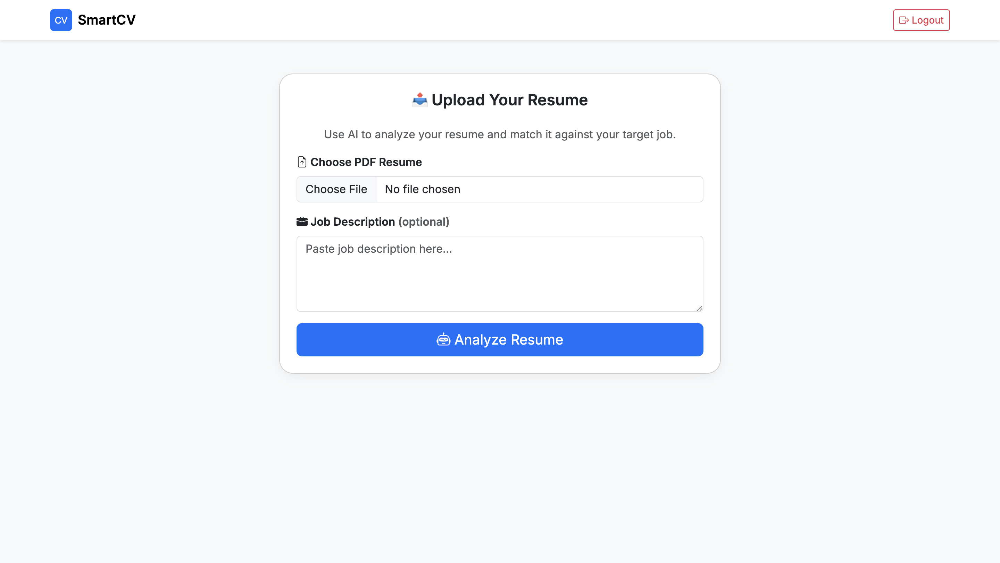
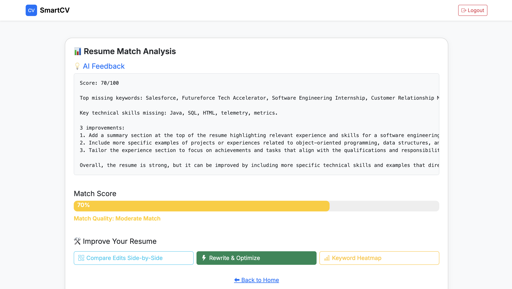
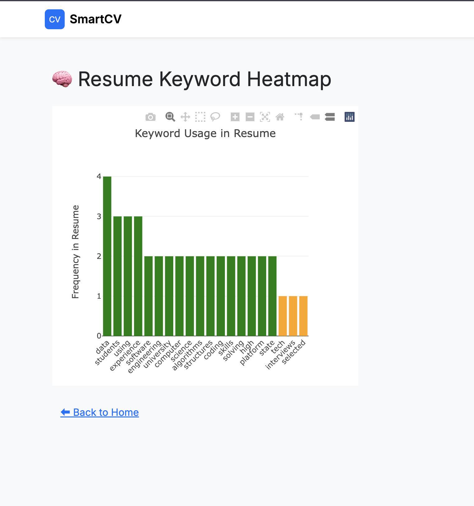

# 🧠 SmartCV — AI-Powered Résumé Analyzer

SmartCV is a Flask-based web app that helps you analyze and improve your résumé to better match job descriptions using GPT-3.5. It offers actionable AI feedback, rewriting tools, and keyword heatmaps to boost your ATS success.

---

## 🚀 Features

- ✅ Upload your PDF résumé  
- ✅ Paste a job description (optional)  
- 🧠 Get detailed AI feedback (match score, missing skills, tailored suggestions)  
- ✍️ Rewrite your résumé with AI-powered improvements  
- 📊 Visualize keyword coverage with interactive heatmaps  
- 🆚 Side-by-side comparison of original vs. rewritten résumé  
- 🔐 Login-protected dashboard  

---

## 🔧 Tech Stack

- **Frontend:** HTML, Bootstrap 5, Plotly.js  
- **Backend:** Flask (Python)  
- **AI Engine:** OpenAI GPT-3.5 Turbo  
- **PDF Parsing:** pdfplumber  
- **Authentication:** Flask Sessions  

---

## 📸 Screenshots

| Upload Resume | Match Score | Keyword Heatmap |
|---|---|---|
|  |  |  |

---

## 🛠 Setup Instructions

### 1. Clone the Repository

```bash
git clone https://github.com/Enochteo/resume-analyzer.git
cd resume-analyzer
```

### 2. Create and Activate a Virtual Environment

**macOS/Linux**
```bash
python3 -m venv venv
source venv/bin/activate
```

**Windows**
```bash
python -m venv venv
venv\Scripts\activate
```

### 3. Install Dependencies

```bash
pip install -r requirements.txt
```

### 4. Run the Application

**If using Flask:**
```bash
flask run
```

**If using Django (adjust accordingly):**
```bash
python manage.py runserver
```

Then visit:  
- `http://127.0.0.1:5000` (Flask)  
- `http://127.0.0.1:8000` (Django)

---

## 📂 Project Structure

```
resume-analyzer/
├── app/ or core/
│   ├── templates/
│   ├── static/
│   ├── routes.py or views.py
├── static/
│   ├── css/
│   ├── js/
│   └── images/
├── templates/
│   ├── index.html
│   ├── fixit.html
│   ├── results.html
│   └── rewrite_result.html
├── requirements.txt
├── README.md
└── run.py / manage.py
```

---

## 🤝 Contributing

Contributions are welcome!

1. Fork the repo  
2. Create your feature branch:  
   `git checkout -b feature/your-feature`  
3. Commit your changes:  
   `git commit -m 'Add your feature'`  
4. Push to the branch:  
   `git push origin feature/your-feature`  
5. Open a Pull Request  

## 👤 Author

**Enoch Owoade**  
📧 [Your Email Here]  
🌐 [Your LinkedIn or Portfolio Link]
=======
# 🧠 AI-Powered Tech Résumé Analyzer

A smart résumé analyzer tool built with Flask and OpenAI — designed to help tech job applicants identify gaps, optimize keywords, and prepare for job applications to top internships.

> 🔨 **Current Build Status:** Resume Upload & Text Extraction Complete  
> 🚀 **Goal:** Fully deployable, AI-integrated résumé optimization app 

---
## ✅ Features (in progress)

- [x] Upload PDF résumé
- [x] Extract raw text from uploaded file using `pdfplumber`
- [ ] AI-powered resume analysis (OpenAI GPT-4)
- [ ] Job description comparison + match scoring
- [ ] Summary/objective section generator
- [ ] Interactive “Fix-it Mode” for bullet points
- [ ] PDF/text export of suggestions

---
## 🧪 Tech Stack

- **Frontend:** HTML, CSS (Bootstrap incoming)
- **Backend:** Flask
- **AI Layer:** OpenAI API (GPT-4 turbo)
- **PDF Processing:** pdfplumber
- **Deployment (upcoming):** Render / Railway / Heroku

---
## 🧑‍💻 Author

**[Enoch Owoade]**  
Engineering Technology Student • Aspiring Software/Embedded Engineer  
GitHub: [github.com/Enochteo](https://github.com/Enochteo)

---

## 💬 Want to contribute or suggest features?

Open a pull request or start a discussion!
>>>>>>> a80d490 (Added first  README)
